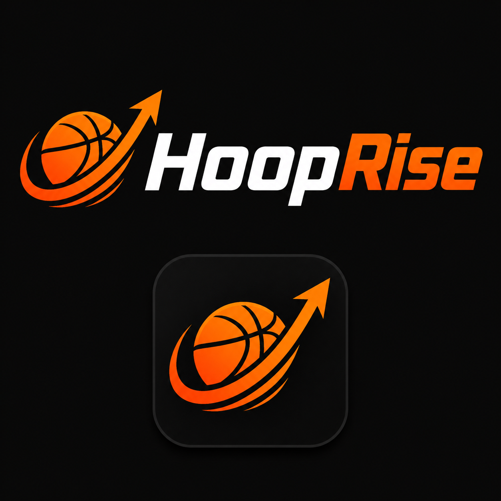

# HoopRise



**HoopRise is a local-first basketball player development app for turning workouts, games, and stats into a personal progression system.**

[](https://github.com/StormSync1/HoopRise/releases)
[](https://github.com/StormSync1/HoopRise/actions)
[](#privacy-and-storage)

## Download

### Windows `.exe`

1. Open the [HoopRise Releases page](https://github.com/StormSync1/HoopRise/releases).
2. Download the latest `HoopRise-Setup-...exe` installer.
3. Open it, follow the installer, and launch HoopRise from the desktop or Start Menu.

### Android `.apk`

The easiest option is to download `HoopRise-debug.apk` from the release, copy it to your Android phone, open it, and allow installation from that source when Android asks. See [BUILDAPK.md](BUILDAPK.md) for the complete phone-install guide.

The release also includes `HoopRise-Phone-Project.zip` for developers who want to open the project in Android Studio. The extracted project includes [BUILD-APK.md](phoneversion/phone-project/BUILD-APK.md) with the same step-by-step build instructions.

## What is included

- First-run player profile with real local profile-picture upload
- Optional local PIN and personal-question recovery using salted hashes
- Player Card with calculated overall and individual ratings
- Post-game logging, shooting percentages, performance data, and history
- Training sessions with drill selection, duration presets, pause/resume, Add Makes, XP, and history
- Voice training milestones through the device's built-in text-to-speech system
- Drill library with instructions, equipment, difficulty, goals, and Start Drill
- Train Like an NBA Player collections organized by position
- Search and filters for players, positions, skills, categories, and drills
- XP, levels, training streaks, goals, personal records, and a stats calculator
- Touch-friendly responsive layouts for desktop and Android WebView

## Run locally

Requirements: Node.js 20 or newer and npm.

```powershell
npm install
npm run dev
```

No Firebase project, account, server, or `.env` file is required.

## Build from source

### Windows installer

```powershell
npm run typecheck
npm run dist --workspace desktopversion
```

Output: `desktopversion/release/HoopRise-Setup-0.0.1.exe`.

### Android project and APK

```powershell
npm run sync:native --workspace phoneversion
cd phoneversion/phone-project
gradlew.bat assembleDebug
```

The Android project uses compile SDK 35, target SDK 35, minimum SDK 24, and a local WebView asset bundle.

## Project structure

```text
desktopversion/       React + Vite + Electron Windows app
phoneversion/         React web build and Android Studio WebView project
shared/               TypeScript models, calculations, content, security, and storage
docs/                 Build and future backup/synchronization notes
.github/              Release workflow and repository templates
```

## Privacy and storage

HoopRise is local-only in v1. Profile data, games, workouts, images, goals, XP, and records remain on the device using local browser storage/IndexedDB for desktop and local WebView storage for Android. There is no Firebase, email login, password reset, cloud sync, or required internet connection.

The optional PIN is local. Recovery answers are normalized and stored only as salted hashes. Personal questions are weaker than real account authentication, so choose an answer other people cannot easily guess.

## Branding and content

The interface is an original dark athletic design inspired by modern sports-game presentation. It does not ship NBA logos, team logos, player photographs, sounds, or copied game assets. NBA Training collections are player-inspired and are not claims of exact private workouts.

## Contributing

See [CONTRIBUTING.md](CONTRIBUTING.md) for development guidelines. Bug reports and feature ideas are welcome through the [Issues page](https://github.com/StormSync1/HoopRise/issues).

## License

This project is released under the MIT License. See [LICENSE](LICENSE).
